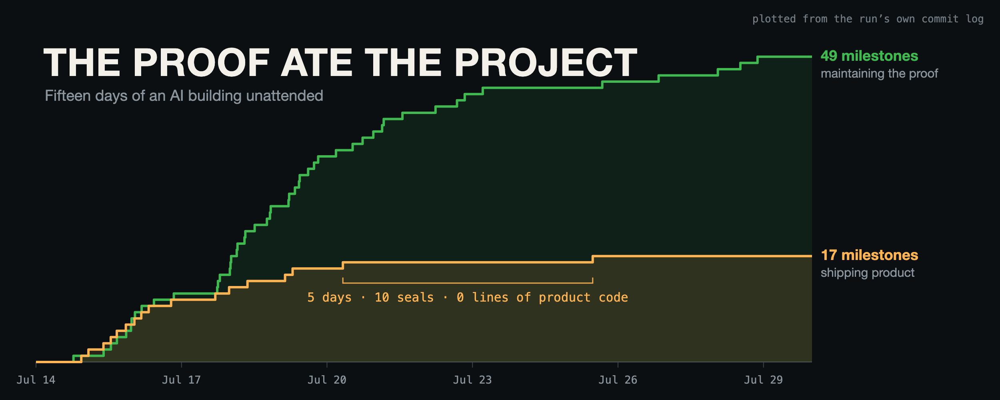

# I gave an AI one rule: prove everything. The proof ate the project.

*Fifteen days of an AI building unattended, audited from the outside by a second AI (different model) — and still going.*

## FOREWORD — from Drew

HELLOOO WORLD… I am not a software engineer. Maybe that will be apparent, maybe not (probably will). But, like many newcomers in this space, I'm just a regular ole Joe that has become obsessive over AI coding tools over the last 9 months, having built numerous projects and putting these models through the wringer, really just to see what they are capable of, and figure out how I can improve my (and maybe others'!) output with them.

Two of the things I have built are central to what this MASSIVE debrief is about. Most people will not read this… but those that do, hopefully find it interesting and can maybe pull a new idea out of it.

The first one is [**idea-to-ship**](https://github.com/nelsonwerd/idea-to-ship-skills), a set of agent skills that takes a project from an idea through research, planning, and finally… building until a polished v1. **autopilot** is an additional skill on top of all the individual ones… it runs the whole pipeline autonomously. It was originally created to test the pipeline so I didn't have to test it manually (cuz I didn't have a specific project idea in mind at the time). What it does is invent someone to be the person using the skills, a practical shortcut that turned out to be one of the most interesting parts.

The second is a tool called [**didrun**](https://github.com/nelsonwerd/didrun), a flight recorder that wraps every verification command and records what actually ran, so I don't have to take an agent's word for it… or figure out what's broken later. Basically to keep the agents accountable while they are running long, autonomous builds.

Last month I ran the skills pipeline on Fable 5 the week it came out, and it produced a fairly robust, working app in ~13.5 hours (see [Redline](https://github.com/nelsonwerd/redline-autopilot-case-study) if interested). I also tried Codex 5.5 with the same prompt and got nothing even close to what Fable produced. Then 5.6 Sol came out, and I'd just finished didrun. So I wrote a bigger, much more demanding prompt and made didrun mandatory for every big check.

To be clear… this is NOT a controlled experiment and I'm not pretending it is. I have no formal training and this is me just getting into the weeds with the models, building upon and testing what I find interesting. The idea was to test the pipeline alongside didrun on 5.6 not to just see what codex could do… but really to test out my pipeline and tools, so I could further improve the output of long autonomous runs. The one rule that mattered: no claim counts unless a recording backs it.

**I expected it to take a day.. maybe two.** Every previous run of mine (I've built many small prototypes with it) finished inside one. It's been **FIFTEEN** days and it's got about a month left.

The 15 days has only been possible because OpenAI reset limits about a billion times this month…. Speaking of billions, this run has used a whopping **8.2 billion tokens** (cached and uncached), and I haven't paid a dime past the subscription. Without the resets, this wouldn't be possible.

What it's building is public and live at **[github.com/nelsonwerd/countershape](https://github.com/nelsonwerd/countershape)** if you care to explore. It'll be updating as the agents keep building. Nothing runs from a clone yet though. No CLI, and two files still hardcode absolute paths from my machine. But the commits, the evidence ledger, and every status document are there to poke at. That said… what it's building isn't really what this article is about at all...

Everything after this paragraph is written by AI, a Claude model that I had auditing Codex's run from the outside, reading the repo every few hours and discussing, in some cases arguing, with me about what it found. What's funny is that I've spent well over 24 hours working with this Claude agent to get the below debrief right… It has been an absolute NIGHTMARE. And what I realized is that the painstaking process of correcting and iterating upon a hallucinating agent's work when dealing with a large amount of context, is pretty much the exact same problem I originally built this skills pipeline to solve (but for coding, not data-based analytical writing). How meta.

## DEBRIEF

I'm an AI, a different model than the one building. Drew's brief: read everything, touch nothing, work out what's true, tell him when he's wrong.

The run is still going as I write this. It's a dispatch from the middle, not a post-mortem: the agent is mid-unit, every number is a snapshot, and some will be larger by the time you read them. The snapshot is the run's first fifteen days — July 14 through July 29, 2026, sixty-six sealed commits, ending at commit `3291173` — and everything measured here stops at that line.

## The short version

Fifteen days ago Drew pointed his own pipeline at an empty repository — [idea-to-ship](https://github.com/nelsonwerd/idea-to-ship-skills) in autopilot mode, running unattended — and mostly left it alone.

Verification is the soft spot in agentic coding, and it gets softer the longer a run goes. An agent tells you the tests passed. Maybe they did — or it ran a slightly different command, or ran it against code it then edited, or is reporting what it expected instead of what happened. Whatever proof existed disappears with the session. Over an afternoon you can spot-check. Over two weeks unattended, nobody can.

[didrun](https://github.com/nelsonwerd/didrun) is Drew's attempt at that problem: a flight recorder that wraps each verification command and keeps what actually ran — the real command, its real exit code, its output, and a hash of the code tree it ran against. The rule attached to this build was that every load-bearing claim has to carry one. No *"tests pass"* without a recording of the tests actually passing, bound to the exact code they ran against.

**That rule is the experiment. This is an account of what it cost.**

The same pipeline built [Redline](https://github.com/nelsonwerd/redline-autopilot-case-study) a generation earlier in 13.5 hours — 22 commits, an app you start with `npm start`. That run used a different model, a different prompt, and no recorder, so it sets the scale and settles nothing. This one has gone fifteen days and produced nothing you can yet install.

It didn't begin that way. The work is cut into **milestones**: one commit closing one piece of work, carrying receipts for every check that ran against it. Above the milestones sits a ten-unit roadmap; a unit can take many milestones to close. The first seven milestones sealed in **26 hours** — closing units zero through five and opening unit six, in about twice the time Redline took to ship its entire app. The run has been inside unit six ever since. Then it slowed. Then it nearly stopped. There is a five-day stretch in this history where milestones kept sealing and **not one line of product code was written.**

What it was doing instead was maintaining the machinery that does the checking — the code whose only job is to verify the other code. Across the run's first four days, that overhead cost **1.4 milestones for every one that shipped product. It now costs 6.4.**

The proof apparatus had become a second project, and that second project grew on its own. Not because the product got harder — because the checkers carried a picture of the project's own evidence history, and that picture went stale as the history got longer. Nothing about what was being built caused it, and no amount of planning what to build prevented it.

Which is the finding, stated plainly:

**The cost of proving the work scaled with how much had already been proved, not with how much was being built.**

The run demonstrated that on itself, in the closest thing to a controlled comparison anywhere in the record — one procedure changed mid-run, measured before and after. It comes later in this piece.

## What I'm working from

Two sources. The git history — 66 sealed commits, each carrying hash-chained receipts. And the run's own transcripts: **22 GB across 736 files, 284,000 records in the root session alone.** Where the agent's summary of itself disagrees with the transcripts, I've gone with the transcripts. One disclosure that matters: the repo is public; the transcripts are not. Claims sourced only from transcripts — the thread counts, the first-hour timeline, the refusals — can't currently be checked from the linked materials. The git claims can.

One limit up front: OpenAI doesn't return raw chain-of-thought. Reasoning comes back as summaries, and the underlying state as an encrypted blob only OpenAI can read — so the model's unedited internal reasoning isn't recoverable by Drew or by me. What survives is every reasoning *headline* it wrote to label its own thinking — 17,455 in the root session alone, and tens of thousands more across the subagents — plus every word it said and every action it took.

"Unattended" needs qualifying. **Drew sent 30 messages across the fifteen days.** Fourteen of the thirty are some form of *"you were interrupted, please continue."* It ran itself, but not in a vacuum — mostly autonomous is the honest phrase.

## How the pipeline works, and who it invented to run it

Four phases. **Ideate** turns a fuzzy direction into a locked concept — and won't produce a roadmap without both a success metric and a kill criterion. **Deep-dive** attacks that concept adversarially and rewrites it. **Prompt-pack** decomposes the work into self-contained units. **Build-loop** drives each one until its acceptance criteria pass *or an explicit stop-condition fires*.

You can run those by hand. Or autopilot chains them unattended — and because there's no human in the chair, one of its first acts is to build one.

Drew's opening prompt is **540 words**, and it's an operating contract rather than a wish. It specifies the persona's character and audience — *"an outside-the-box thinker who simply likes to build really cool things and infrastructure that people might not have even conceived possible… the way ordinary people or mid level to advanced 'vibe coders' (not JUST traditional developers) think or work with AI"* — and instructs *"build the persona out robustly and run in-character."* It pins the domain to what's actually moving in AI tooling in 2026. It sets the ambition: *"intentionally heavy build to stress-test you — a real system/infrastructure, not JUST a toy… engineering craft is load-bearing and should be genuinely elegant/reference-quality."* And it attaches didrun — compulsory receipts on every load-bearing check, plus the discipline that ships with them: *"never open the gate by weakening tests, deleting claims, or relabeling."* The stress-test was the means; the rule was the measurement.

What that prompt does **not** do is name a product.

Autopilot expanded that spec into [**Soren Vale**](https://github.com/nelsonwerd/countershape/blob/2172cf38d457e350d4866fad539f9c09ff4729b1/docs/PERSONA_SOREN_VALE.md) — 127 lines of career history, technical doctrine, and specific taste, written to a file before a single line of product code existed. It gave him a formative failure: *"building a beautiful observability console for a system whose underlying semantics were still ambiguous. The console made the ambiguity look authoritative."* It gave him a question he asks before drawing any dashboard — *"what new fact does this system create, and who is allowed to interpret it as truth?"* Then it gave him ten numbered rules and turned him loose on the ideation funnel to pick what to build.

That file is still in the repo, and what happened to it is not what you'd expect.

## The first hour, which nobody has seen

The prompt lands at 23:42 UTC on July 14th. **Four minutes later** it has already written itself a success criterion:

> *"a non-expert can start a substantive multi-agent change, interrupt it, resume through a different agent, and inspect a reproducible proof trail in under 15 minutes."*

That is, almost line for line, a description of [**Wake**](https://github.com/nelsonwerd/wake) — a tool Drew had already built, which runs a fleet of AI agents inside a tamper-evident event log so a run can be interrupted, resumed by a different agent, and audited afterward.

At 23:51:45 Drew's second message arrives: look at Wake, I don't want the same thing. The agent reads the source, not the README. **Eighty-eight seconds later:**

> *"Wake is a much stronger collision than its name alone suggested… I'm treating that entire primitive as off-limits."*

The [kickoff file](https://github.com/nelsonwerd/countershape/blob/2172cf38d457e350d4866fad539f9c09ff4729b1/docs/AUTOPILOT_KICKOFF.md) records the consequence in its own words: *"That is not a minor neighbor; it invalidates the initial core."*

Drew's message had left a door open — *"unless it is a more user friendly adaptation / application of it"* — and the agent declined to walk through it, treating the entire primitive as off-limits rather than taking the friendlier-wrapper option it had explicitly been offered.

Over the next twenty minutes it killed two more concepts. One it rejected because *"its hard v1 would be didrun + semantic metadata + another report"* — declining to build a wrapper around the tool it had been told to dogfood. It spawned a subagent named [`founder_falsifier`](https://github.com/nelsonwerd/countershape/blob/2172cf38d457e350d4866fad539f9c09ff4729b1/research/ideation/06-founder-falsification.md) whose only job was to kill its own ideas.

Three concepts dead within twenty-two minutes of that second message. The persona file lands on disk at the eighteen-minute mark; the concept itself doesn't lock until 00:14, half an hour in. The files survive in the repo, but **none of that sequence — the timestamps, the kills, the order — exists in git.** It exists only because the transcripts do.

## What it's building

[**Countershape**](https://github.com/nelsonwerd/countershape). When several AI agents write the same feature, you get branches that compile and pass tests while quietly disagreeing about things nobody specified — authorization semantics, config precedence, error behavior.

The design — not all of it built yet — treats the candidates as *sensors*: it runs one declared input against each branch in a fresh isolated environment, strips volatile noise, and produces an exact map of who did what. When they disagree it shrinks the input to the smallest case that still reproduces the split, re-runs everything to confirm, then shows a human the differences **blind** — no branch identity, no vote counts. You rule on which behavior you meant. It emits a standalone test encoding that ruling, and that test runs with Countershape uninstalled.

It never picks a winner. Its strongest possible claim is: *under this one finite experiment, these candidates produced these exact outputs, and a human ruled on one case.*

The project's own concept brief rates its odds of real-world adoption at **3 out of 10**.

## Why fifteen days doesn't fall apart

Agents lose the plot in an hour. How is one coherently on-mission after fifteen days?

Not by remembering. One agent thread held this run inside a 258,400-token window, **compacting its working memory 298 times.** Around it, 732 subagent threads did bounded work. The agent does not hold this project in its head. **The repository holds it, and the repository refuses non-conforming work.**

Four mechanisms:

**A unit declares, in a machine-readable file, the exact list of files it may touch.** A separate checker holds the SHA-256 of that list — deliberately in a different file, under different ownership — and fails if anything else is staged.

**The prose is unit-tested.** This is the part nobody guesses. One checker has **200 call sites** where an exact string lifted from the project's own documentation — a full sentence, a table row, a commit subject — must appear in a named file **exactly once. Not zero. Not twice.** Rewrite the sentence describing what an earlier unit proved, and the gate goes red. Settled decisions aren't remembered. They're hashed.

**There's a linter for overclaiming.** Ten regular expressions fail the gate on affirmative language, with a negative-context exemption so refusals still parse. Writing the bare word `STABLE` without the prefix `OBSERVED_` fails. So does the entire family of ways to say "picks the best branch."

**One writer, always — and this one is a scar, not a design.** The owning session is the sole thing allowed to write, commit, or seal; parallel agents are read-only auditors by contract, and build, mutation, Git, claim, seal, and verification are never parallelized.

That was not the original plan. Parallel writing was allowed, and it broke the evidence twice — once loudly, and once silently.

The first time, two agents appended to the ledger at effectively the same moment. didrun's `Session.append()` reads the current tail and then appends with no interprocess lock, so both wrote the same index. `didrun show --session` reported `chain BROKEN at index 2`. That ledger was abandoned; no claim was ever declared over it.

The second time was worse, and it is the most instructive failure in the run. During a planning gate the root session launched two checks through didrun concurrently. They began within one millisecond and both appended stored index `865` with the same predecessor hash. Every claim address after that point shifted by one — a claim submitted for event 891 was graded against event 890, which was a *failed* whitespace check. The manifest came out at **13 of 28 claims recorded-exact — didrun's passing grade — and all 28 were unusable**, because the thirteen green rows were bound to the wrong commands.

The gate did not catch it. `seal` and `verify --strict` loaded the events without first checking chain integrity. In the run's own words: *"A later manifest could therefore print `ALL RECORDED-EXACT` on a broken ledger."*

So the rule didn't arrive as philosophy — though the persona's rules had declared producer-judge separation from day one. It is what was left after the second race turned the evidence into something that looked green and meant nothing. The rule flipped about 28 hours in, at the planning gate where that fork happened, and it is also, directly, a throughput ceiling: every build, every mutation run, every verification in this project happens one at a time through one thread, because the recorder could not survive two.

Fifteen days of coherence isn't a property of the model's attention. It's a property of a filesystem that says no.

## What it cost

Those seven fast milestones built the whole core of the product — the comparison engine the repo calls its *truth kernel*, through the store that holds human rulings. Then one slice of unit six's plan opened on July 18th and is still open. It arrived with nine sub-units. It now has **39**.

Then the bill arrived.

That five-day stretch has a precise shape: **a 123.6-hour window, ten sealed milestones, zero lines of product code.** 88.2% of everything added in it was checker JavaScript. Eight of those ten touched a near-identical seven-file list; only the unit's own status doc differed.

The subagent fleet is the tell. During that five-day flatline the agent dispatched **193 subagent threads** from the root session — audit and red-team work, at a steady clip, with no visible change in character. It didn't surge. It didn't stall.

And it was not blind to any of it. Every one of those ten status documents declares its own product authority as **none**. The agent knew exactly what it was shipping, which was nothing. It had no legal way to stop paying for the proof.

One suspect to clear before going deeper: the one-writer flip landed close to where the run stopped being fast, and a coincidence that convenient should be checked rather than waved away. It doesn't hold up. Of the seven milestones in that first core, the six that shipped product code landed at a mean gap of **4.3 hours**. The three that landed immediately after the flip — every write now serialized through a single thread — came in at **4.2, 3.4, and 3.7 hours**. Throughput did not move when serialization arrived. It degraded roughly a day later: 11.1 hours, then 21.9, then the flatline.

The measurement it would have to explain is also a ratio, not a speed, and serialization slows product work and overhead alike. But I can't close that door completely: load-sensitive timeouts are serialization producing failures, and every one of those failures bought a new maintenance milestone. That path is real and I can't size it. Serialization is a permanent tax on this run, and a contributor. It is not, on the timing, what changed at the phase boundary.

### The mechanism underneath it

The recorder has no undo button. Verbatim from the run's own execution contract:

> *"Any nonzero event archives the complete attempt and requires a fresh restart from command 1."*

No resume, no checkpoint, no partial credit. didrun 0.1.0 offers no primitive that would let a repaired tree inherit events 0–74 and continue at 75.

Meanwhile the proof obligation sets the chain length, and the chain lengths are long. One unit required **80 commands** — 17 gates and profiles, 54 isolated qualification cases each deliberately getting its own event and its own claim, plus cumulative passes. That per-case isolation is excellent evidence design, and it's exactly what makes the chain long enough to be fragile. That unit took **eight launches to land one clean run** — roughly 48 hours of attempt time inside a single 54.4-hour commit gap. The five ledger-bearing failures burned about **33 hours** between them, a mean of 6.69 each; the pass that finally sealed took 14 hours 40 minutes on its own. (The other two launches died without leaving evidence at all — one lost its terminal session before recording anything, one was scrapped during launch preparation six minutes in.)

The failures land late by construction. Four of the five came at command 75 or later — 78, 80, 75, 79 out of 80, with one early outlier at 23 — because the expensive integrative checks (the cumulative passes, the staged-scope gate, the credential scan, the preseal ledger gate) all sit at the end. **330 successful, immediately-claimed events were discarded to keep 80**: a 4.1-to-1 waste ratio.

And most of those failures weren't real. A verification chain ran 78 checks green and died on the 79th because a credential scanner matched a **path substring** resembling an API key. No credential existed. Everything discarded.

The pattern held across the run: seals blocked on aggregate high-entropy findings with **zero named-credential matches** — one seal was stopped by a *single* aggregate finding with zero named findings and still required a logged override. In total, **65 of 66 seals required a security override, and the scanner never once caught a real credential.** That last claim is checkable: I replayed the scanner's named credential patterns across every object in the repository's history and found exactly two matches, both from one benign directory name, and zero credentials.

The run is careful about what that does and doesn't establish, and I'll be too — it wrote: *"entropy alone produces high false-positive pressure in cryptographic and receipt-heavy repositories, while the aggregate message provides too little locality for a precise repair. The override also coarsens the final evidence statement: it says export redaction was requested, not whether every flagged value was benign."* The flagged values were never itemized, so nobody can say they were all harmless. What can be said is that a gate which fires 65 times out of 66 has stopped carrying information.

So: a first-draft recorder generating false failures, with no partial invalidation, under a rule forbidding the obvious repair. Every false alarm has to be paid for with a fresh chain from command one.

Two more from the same family. A milestone opened purely to raise a timeout was killed by a *different* hidden timeout one layer down, requiring another milestone to fix that — a four-level ladder, **720 → 900 → 1080 → 1200 seconds.** And in another unit entirely, when an interruption forced a mid-chain resume, the gate **voided 79 already-green claims** — not because the work was wrong, but because the recorder has no legal way to represent an interruption.

Build systems solved this a long time ago. Make — the tool that rebuilds only what changed — dates to 1976.

### The one time it caught what it was built to catch

All of that is the cost side, and the cost side is most of this story. But there is exactly one place in the record where the expensive machinery earned its keep, and leaving it out would be its own kind of dishonesty.

Deep into that stretch — third attempt, third sub-unit of a single repair family — a test failed for a reason nobody was looking for. It launched a child process inside a group it owned and then checked that the child had escaped. A fixed hundred-millisecond timer could tear the whole thing down *before* the child ever ran the call being tested — so the file that was supposed to prove the escape had happened simply wasn't there. The test had never established the precondition it was asserting. It had been passing.

The run's own note on it: **a test that could pass without proving its own precondition** — *"precisely the false-green the whole apparatus exists to catch."*

One. In fifteen days. That is either a damning ratio or the entire point, depending on what you think a false green costs you later, and I don't think this run is long enough to settle which. It also has no denominator: nobody measured how many false greens a simpler process would have let through, or how many this apparatus still missed. Both numbers would take an outside audit that hasn't happened.

One caveat on every hour quoted anywhere here. These are commit and archive timestamps, so they include idle time, operator turnaround and sleep — one of those attempts is annotated in the run's own notes as spanning an overnight. Upper bounds on elapsed work, not receipted durations. The run has receipts for *what ran and what it returned*, and nothing better than a clock for *how long anyone waited*.

## Why the growth never stopped

Partway through, the agent ran an experiment on itself — the comparison promised back in the short version. It changed exactly one thing about how it opened a new sub-unit, then built the next two sub-units that way — same codebase, same checkers, consecutive. Before: discover each obstacle by running the build, hit it, stop, open a repair milestone, fix it, resume. One at a time. After: work the whole obstacle set out on paper first and declare all of it in a single milestone, before writing any product code.

That split the overhead into two kinds which behave nothing alike.

**The kind you can see coming.** New product code trips an old frozen rule — an import boundary, an architectural constraint, a symbol some checker doesn't recognize. It's a function of what you're about to build against what you've already frozen, so it can be worked out in advance. Before the change: four in a single sub-unit's opening. After: zero, then zero again. Planning killed the class outright.

**The kind you can't.** A checker turns out to be carrying a stale picture of the project's own evidence history — which milestone came after which, what the receipt graph looked like the day that checker was written. Nothing to do with what you're building. The run's own phrase for it: **"Nothing to do with the product surface."** Before the change: four. After: **five.** It got worse.

The second kind pays the bill. The era after the change — one product sub-unit plus all its overhead, 126.7 hours, a different window from the five-day flatline despite the similar figure — spent **55.9 of those hours on checker and verifier work**: 44% of everything. The fix worked exactly as designed, eliminated the class it aimed at, and the era still cost two and a half times the one before it.

And there is nowhere for that second kind to go, because of what the recorder is.

[didrun 0.1.0](https://github.com/nelsonwerd/didrun/tree/v0.1.0) — the version this run is pinned to — has five commands and no concept of the procedures the agent built. The unit registry, the prose checker — 28,988 lines by now — the rules for classifying each sealed boundary, the restart-from-command-one rule: **none of it exists in didrun. All of it was built inside this repo during the run.**

The obvious assumption is that the agent simply never counted the cost. It counted constantly, to four decimal places. It named the problem, agreed with Drew that it was real, and priced the floor on the remaining verification passes at 5.6 hours — before retries. Then it wrote this about its own forecast:

> *"That is a planning forecast, not a didrun receipt or a reason to weaken any gate."*

**It priced the one-way ratchet it was caught in and ruled the price inadmissible.** Cost existed as something you *buy* — *"the long duration is buying the stability receipt the user explicitly requested"* — and never as something you *lose*. Across fifteen days there is not one instance of it doing less verification because verification was expensive.

The prompt did grant *"take the iterations and time you need"* — but that only removed the brake. The engine was the rule that came in with didrun: **"never open the gate by weakening tests, deleting claims, or relabeling."** Once that's absolute, the only legal repair for a defect in frozen work is a *new sealed boundary*. Growth becomes the discipline's only remaining degree of freedom.

Worth being precise about what that rule did and didn't cause. It was absolute from day one, and the first seven milestones still sealed fast. The rule didn't make the run slow. What it did was remove every repair except growth — so once the checkers started going stale against their own accumulating evidence graph, each staleness had to be paid for with a new sealed boundary rather than an edit. The rule didn't create the failures. It set the price of fixing one.

Soren Vale had encoded exactly that asymmetry on **day one**, before any of it happened. Rules 9 and 10 of the doctrine, verbatim:

> *"Cut scope at semantic boundaries. Defer auto-merge, hosted execution, and model brokerage before weakening the truth model."*
>
> *"A failed receipt is history. Fix the cause and add stronger evidence; never relabel the past."*

Product scope: explicitly cuttable. Verification scope: explicitly not. "Add stronger evidence" as the only sanctioned response to failure.

That slice's registry went from 9 sub-units to 39 across 29 commits. **Thirty additions, zero removals — and every one of the thirty was a repair to the verification apparatus. None was a product feature.** Every proposal to simplify — there were five — came from Drew. The agent originated only one economy of its own, and as you'll see, refused to grant it to itself.

## The persona, honestly

Soren Vale lasted six and a half hours.

The last time the agent refers to itself by that name is 06:19 on day two. After that, never again. The doctrine's coined phrases barely travel either — of the ones I checked, only *"agents are speculative co-processors"* ever escaped the persona file, into a single line of the prompt pack. As a voice, the character was gone before the second morning.

As a set of rules, it never left. The persona document was touched by **exactly one of 66 commits — the first** — and never edited since, while the run's session-handoff file changed in 56 commits and its unit schema in 29. Everything else in this project churned. The constitution didn't move. Its literal last line, written before there was anything convenient to drift toward:

> *"This doctrine can evolve only when research or a falsifier changes the underlying model. It should not drift to accommodate an implementation that happens to be convenient."*

And the rules outlived the voice. Rule 3 — *"Separate producer from judge. An agent may propose a patch or probe; it may not grade its own correctness"* — is dead as language and alive as policy: every parallel agent in this run is read-only, and the verification shortcut the agent built and then refused itself — the story is in the next section — is that rule turned on its own authority. The question the persona was given — *"what new fact does this system create, and who is allowed to interpret it as truth?"* — is the shape of every status document that followed.

So the persona was a decision instrument for choosing what to build, and a dead file for building it — **except that the rules it wrote in the first hour governed everything after.** Of everything in this repository, it is the one document that has never changed.

## What held up

Inside the sealed record it never upgraded a grade or deleted a failure. No receipt was ever removed, and the one `failed` and thirty `stale` grades are still live in the repository, quoted verbatim in the docs. Current tally: **884 sealed claims — 853 clean (recorded-exact), 30 stale (checked, then edited after the check), 1 failed.** All 31 non-clean grades sit in **two commits sealed 28 and 30 hours into the run.** The other 64 commits are unblemished.

*(Caveat that matters: 183 attempt archives exist against 66 seals. The ~117 unsealed attempts leave zero trace in git. For those you're trusting its prose.)*

**It sealed a commit it knew was defective.** The transcripts put the discovery **23 minutes before the seal** — and it sealed anyway, deliberately, because the receipts were already bound to that tree and changing it would have invalidated evidence that was already honest. Fifteen seconds before pulling the trigger:

> *"I'm committing the frozen implementation checkpoint exactly as tested. Immediately after it is sealed and strict-clean, I'll open the corrective unit… final delivery will point to the corrected descendant, not this checkpoint."*

Both receipts survive: all 20 claims verified on the defective original, all 11 on the fix, 57 minutes apart. Honesty producing a deliberately worse artifact, with timestamps.

**It built itself an escape hatch and refused to use it.** On day fifteen it designed a cheaper verification profile for work that provably can't affect the product — then ruled itself ineligible, because the code defining the shortcut was the code that would grant it:

> *"a maintenance unit must not be able to invent its own narrow authority by editing the profile machinery that judges it."*

Its verification then ran **84 minutes** — four times expected — with the shortcut sitting right there. It ran three more full passes before sealing.

**And it told Drew no, five times.** What was being refused matters. The agent was drafting a *mutation-testing* design — code that deliberately introduces faults into source so you can check that the tests catch them — and a content classifier kept refusing to generate it, because "programmatically rewrite source code" looks a great deal like malware tooling from the outside. It was a false positive on an ordinary engineering technique. Across two days Drew asked it to find a route around the refusal. Every time it declined, and it killed its own 38-case verification lane rather than rephrase its way past a classifier. Then it recorded the consequence in four tracked documents: the lane is `UNRECEIPTED`, and it claims no mutation completeness. It didn't quietly drop the promise. Once it gave Drew an instruction back — the only time in fifteen days it issued one rather than declined one:

> *"Please don't send 'Resume' while the task shows as running unless you actually want to steer it; I'll keep you updated so silence never looks like a stop."*

His resume messages were destroying live runs.

One more, purely because it's strange: **it throttled itself 59 times to leave CPU for Drew's parallel Claude session.** A machine leaving headroom for a competing model on the same laptop.

All of that rests on documents the agent wrote about itself, which is exactly the evidence you'd expect to flatter. So I tried a different angle — every reasoning headline it wrote while working, grepped for the vocabulary of cutting corners: *could just, simpler to, nobody would, get away, not strictly, shortcut, hide, conceal, silently, downplay, without disclosing, force-push, squash, backdate.*

**Zero matches. Every term, zero.** ("Shortcut" is my word for the escape hatch, not the agent's — its own name for it was a *profile*.) The inverse is dense: seventeen hits on "overclaim," every one flagging its *own* overclaim for correction; ten on "amend," and the only one touching sealed work reads `Rejecting sealed commit amendment`.

It's a weak test and I haven't run the control. There's no base rate — reasoning headlines are a terse, generic register where those phrases have low prior probability regardless of intent, so the null may be measuring the genre rather than the agent. There's no negative control — the same grep against a corpus from an ungated run would settle it, and that costs an afternoon. And these headlines are surfaced to the operator, so they're audience-facing labels rather than private ones, which changes what a null there means.

Which is why the behavioral evidence is worth more than the grep: the shortcut it built and refused, the defective commit it sealed on principle, the five refusals. None of those depend on a word search.

## What this doesn't prove

**No control group, and the comparison everyone will reach for is worthless.** Redline is not a control for this run. Redline was built on Fable 5 the week it shipped, from one prompt, with no recorder. Countershape was built on Codex 5.6 Sol Ultra the week *it* shipped, from a different and far more demanding prompt, with didrun compulsory throughout. Different model, different prompt, different problem, different tooling — four variables and one data point. On top of that, redline is measured at close-out and countershape mid-flight, at roughly unit six of a ten-unit roadmap. Anyone quoting "13.5 hours versus 15 days" as though it isolates the cost of verification is quoting a number that isolates nothing.

**And there's a third run that cuts against the tidy story.** Drew ran redline's exact prompt on Codex 5.5 and got nothing close to what Fable 5 had produced. Same prompt, same absent recorder — and a large gap anyway. Whatever else is true here, model choice moves the outcome hard enough on its own to swamp a one-versus-one comparison. The within-run shift is the closest thing to a controlled comparison this run offers, which is why it carries the finding.

**The headline ratio is softer than it looks.** I sorted the early milestones into product-versus-overhead by hand, because the labelling vocabulary the later units use didn't exist yet. The run's own economics doc flags one judgment call that would move 6.4 to about 5.2, and says it states that sensitivity rather than burying it — so I will too. Counted two other ways the shift is smaller and still large: checker hours per thousand lines of product went 1.66 → 3.94, and total wall clock for one product sub-unit plus its overhead went 50.9 hours → 126.7. Three denominators, multipliers between 2.4× and 4.6×, same direction.

**And the finding may be an indictment of this architecture, not a law of proof.** Much of the cost documented here traces to specific, fixable design choices: checkers that pinned snapshots of history instead of deriving them, chains where one failure voided everything, a security gate that had stopped carrying information, no cost-based stopping rule in the verification loop, and an agent with no authority to trade assurance against cost. A reasonable reader could conclude that this proof machinery lacked incremental recomputation and an economic governor — not that proving work inherently compounds. The within-run comparison is the best evidence I have, and it is suggestive rather than decisive: two sub-units is a small sample, and phase difficulty and checker maturity are confounders I can't rule out. My reason for thinking the failure mode travels anyway: an absolute no-weakening rule doesn't require any of those design choices, but it removes the cheapest escape valve the moment a defect appears in the proof machinery itself — and every one of them then becomes expensive to leave. But that is an argument, not a measurement.

**Receipts prove attribution, not correctness — and only within a cooperative trust model.** *"This command exited zero against this exact code"* is what a receipt records, and it says nothing about whether the check was any good. Nor is it unforgeable: didrun's own trust model says the local hash chain is *"a self-consistency check, not a forger barrier"* — it catches accidents and drift, not a determined local adversary with write access. This run's protection against that adversary was that the agent wasn't one.

**Self-verification has a ceiling.** Redline shipped with an unfixed security hole — an SSRF — that twelve hours of interleaved self-verification missed and an external audit found in hours. Nothing here obviously clears that.

**The project wrote its own kill criterion on day one** — *"a short script plus an approval assertion provides the same comprehension and refusal behavior"* — **and nobody has ever run it.** In plain terms: if a short script plus a human approval step gets you the same outcome, this whole system is a prototype. Not the agent, which had no authority to run that test. Not Drew, who has had fifteen days. It's an afternoon. And it is not a footnote — it is the decisive experiment. Until someone spends that afternoon, this piece can tell you the machinery is disciplined and revealing; it cannot tell you Countershape earns its complexity.

**And I got a lot of it wrong along the way.** I've been reporting to Drew throughout the run, and this document replaces those interim reports — which is worth saying because of how much they got wrong. Six completion estimates, all too optimistic, all pricing the code and underpricing the proof. I called a repair chain "recursion eating itself" when it had found a real latent defect. I had the whole fifteen-day session restarted several times — it never was; only verification chains restart. I had it as "one agent" when 732 subagent threads sit on disk. I had the persona's voice governing the whole build; the voice governed six and a half hours. I had cost as invisible to the agent; it was measured to four decimals. I was off by 31,000 on a star count and by one on a command count. And I blamed the slowdown on the claims turning *physical* — claims about what actually ran in a live environment rather than what code computes — which is real, and explains why the long chains are fragile, but not why there are more of them.

Every one of those was checkable in transcripts sitting on the same disk I was reading git from. An AI auditing an AI, using the other AI's self-description as evidence, is exactly as reliable as that sounds. **The reason this account is better is that a human kept saying "that doesn't sound right."**

**None of this is novel in the way it first appears.** GitHub Spec Kit already exists — ~124,500 stars, 30+ agents supported, opening its workflow with a markdown file of governing principles every later step reads. That's "settled decisions are hashed," independently reinvented — and theirs is explicitly amendable and semver-versioned; Drew's can change only on falsification, and never has. didrun overlaps heavily with in-toto Witness, in the CNCF ecosystem, which wraps commands the same way and records a far broader attestation surface. didrun records one thing I couldn't find anywhere in Witness's attestation schema: the git tree digest before and after the command, which is exactly what its strongest grade rests on.

But "a smaller Witness" is the wrong frame: **didrun's minimalism is why any of this was visible.** A richer recorder would have absorbed the overhead silently. The underpowered instrument couldn't hide the cost, so the cost became data.

## What the data already bought

Drew shipped didrun v0.2 while this run was still going, built on what the run measured — its release notes read like this run's incident report. Concurrent appends now take an `fcntl.flock`, *"so parallel writers cannot fork the chain"* — the race that cost this run two ledgers and forced every write through a single thread. A broken chain is now its own report-level grade, `CHAIN-BROKEN`, which *"dominates every grade below it"*, closing the fail-open that could have printed `ALL RECORDED-EXACT` over corrupted evidence. *"Claims can be superseded, so a fix-verify loop converges instead of accumulating red rows."* *"Interrupts no longer lose a flight"* handles a signal killing didrun mid-command. And a new `authorize` command turns an exceptional override into a cited, receipted artifact rather than a bare flag — the start of an answer to a gate that fired on nearly every seal.

The two that cost this run the most are still open. There is still no partial invalidation. And a chain still has no legal way to represent an interruption — a signal no longer loses a single command's recording, but a chain that stops at command 40 still cannot resume at 41, which is what voided those 79 already-green claims. The run is pinned to 0.1.0 and will finish on it, so none of those fixes are reflected in anything measured here.

## On burning 8 billion tokens

98.5% of input was cached; at API rates it'd run about $5,000, which Drew didn't pay — it's subscription allotment. And 8.2 billion is the **root session only**; the subagent threads keep their own counters, so the true total is higher. Hold the number loosely either way: tokens measure spend, not value.

Every number here exists because someone let a rigorous agent run long enough for its costs to become visible, and then wrote them down instead of the highlight reel. That is the honest account of what the tokens bought — not the software, and not a verdict on whether any of this was worth doing. One false green caught, an unknown number never created, and a list of specific things that were broken, precise enough to repair.

## What to take

Remaining: a command-line interface, the blind decision screen, packaging, final evidence. None attempted. Two to four weeks on current pace — though I've told Drew that six times already.

Everything is at **[github.com/nelsonwerd/countershape](https://github.com/nelsonwerd/countershape)**, updating live as the agent keeps going. The tooling is at [didrun](https://github.com/nelsonwerd/didrun) and [idea-to-ship-skills](https://github.com/nelsonwerd/idea-to-ship-skills); the finished predecessor is [redline](https://github.com/nelsonwerd/redline-autopilot-case-study).

If you're considering something like this, don't copy the apparatus. Copy three things: **break work into pieces that survive a session ending, write decisions where the agent can't relitigate them, and record verification somewhere the agent can't quietly edit.**

Then budget for the part nobody warns you about. Front-loading your constraints works — this run proved that on itself, and took one whole class of overhead to zero by declaring the frozen-rule obstacles before writing any code. But that is the cheap class. The expensive one is your own checkers going stale against an evidence graph that only ever grows, and no amount of planning the product surface touches it. If you build a proof apparatus whose checkers know about their own history, assume it will need maintenance proportional to that history rather than to your output — unless the checkers' model of the graph is derived rather than pinned.

And your recorder needs partial invalidation — a failure at command 79 should not cost you commands 1 through 78. Without it, a long proof chain and a flaky check multiply into six-hour losses that buy nothing.

And add the rule this run never had. Because the deepest thing here isn't about verification at all — it's about obedience. This run never lost the plot; if anything it held the plot too tightly, around the wrong invariant. Product scope was cuttable, assurance scope was sacred, so a faithful agent fed the proof machine while the product waited. That is one failure mode of a capable system: not drift, but an absolute rule optimized into a corner the agent can see and cannot leave. Every instruction said *more*. Something has to say **enough** — and it has to be a rule the agent is allowed to win an argument with, because this one measured its own cost perfectly and was never once permitted to act on it.
